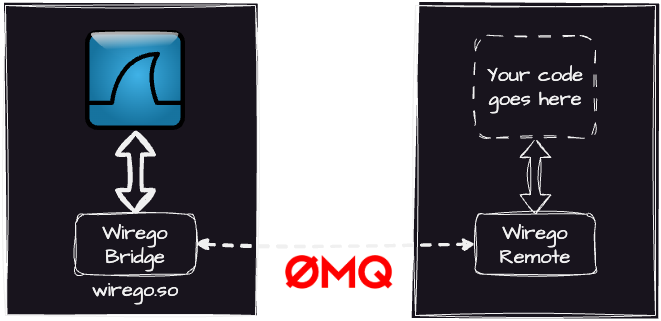

# Wirego 

|    |    |
| -- | -- |
|  |  A Wireshark plugin framework based on ZMQ, supporting Golang and hopefully more languages soon. |


## Introduction

Writing plugins for Wireshark in C/C++ can be opaque: the APIs are quite powerfull, but not really obvious to use. If you just want to develop a quick and dirty plugin you will spend more time trying to understand how things work instead of actually writing the core of your plugin.

Another alternative is to use LUA, but first of all you need to know this language. So again, you'll spend more time trying to learn that new language than actually writing this quick and dirty plugin.

Wirego is a composed of:

  - a Wireshark plugin (wirego_bridge), written in C that will transmit all calls from Wireshark to a remote ZMQ endpoint
  - A set of packages for several languages receiving those ZMQ calls and converting them to a simple API that you can use




As a starter, a **golang** package is provided and more languages will come later.


In all Wirego's code and documentations we will refer to:

  - **Wirego bridge** : the Wireshark plugin, written in C (you won't have to touch this one)
  - **Wirego package** : a package/class/bundle/sdk for a given language, used to make things easier on your side
  - **Wirego remote** : the application that you will develop using the **Wirego package**

## Getting started

In order to setup Wirego, you will need follow 3 steps:

  1. Install or build the **Wirego bridge plugin** for Wireshark
  2. Develop your **Wirego remote**, using a **Wirego package**
  3. Start your **Wirego remote** program
  4. Start Wireshark and tell the Wirego bridge where your ZMQ endpoint is

You may use prebuilt binaries for **step 1**, those can be downloaded [here](https://github.com/quarkslab/wirego/releases).
If prefer building the plugin (or if prebuilt binaries fails), refer to the following documentation [here](./doc/BUILD_WIREGO.md)


The **step 2** will obviously depend on the language you're using.

### Overview in Go

For Go you will basically just have to copy/paste the **main()** function from one of our examples and implement the following interface:

```golang
    // WiregoInterface is implemented by the actual wirego plugin
    type WiregoInterface interface {
      GetName() string
      GetFilter() string
      GetFields() []WiresharkField
      GetDetectionFilters() []DetectionFilterType
      GetDetectionHeuristicsParent() []string
      DetectionHeuristic(packetNumber int, src string, dst string, stack string, packet []byte) bool
      DissectPacket(packetNumber int, src string, dst string, stack string, packet []byte) *DissectResult
    }
```

It's probably time for you to take a look at the minimal Go example found in [./wirego_remote/go/examples/minimal/](./wirego_remote/go/examples/minimal/README.md)

### Overview in Python

When using Python, you will need to declare a class inheriting **wirego.WiregoListener** from the **wirego** python package.

The following methods (callbacks) needs to be implemented:

```python
class WiregoListener(ABC):

    @abstractmethod
    def get_name(self) -> str:
        pass

    @abstractmethod
    def get_filter(self) -> str:
        pass

    @abstractmethod
    def get_fields(self) -> List[WiregoField]:
        pass

    @abstractmethod
    def get_detection_filters(self) -> List[DetectionFilter]:
        pass

    @abstractmethod
    def get_detection_heuristics_parents(self) -> List[str]:
        pass

    @abstractmethod
    def detection_heuristic(self, packet_number: int, src: str, dst: str, stack: str, packet: bytes) -> bool:
        pass

    @abstractmethod
    def dissect_packet(self, packet_number: int, src: str, dst: str, stack: str, packet: bytes) -> DissectResult:
        pass
```

When it's done simply register your class to Wirego and start listening for Wireshark's commands:

```python
print("Wirego remote Python example")

# Create our listener
tl = WiregoMinimal()

# Instanciate wirego
wg = wirego.Wirego("ipc:///tmp/wirego0", True, tl)
wg.results_cache_enable(True)

wg.listen()
```

It's probably time for you to take a look at the minimal Python example found in [./wirego_remote/python/examples/minimal/](./wirego_remote/python/examples/minimal/README.md)


### Running Wirego

Now it's time for **step 3**: [install the Wirego plugin and start Wireshark](./doc/RUNNING.md)!

## Examples

A few plugin examples are available for each languages:

**In Go:**

  - [Minimal](./wirego_remote/go/examples/minimal/) : a minimalistic example showing the basic usage of Wirego
  - [Reolink Credentials light](./wirego_remote/go/examples/reolinkcredslight/) : a lightweight version of a Reolink camera credentials parser
  - [Reolink Credentials](./wirego_remote/go/examples/reolinkcreds/) : an advanced version of a Reolink camera credentials parser


**In Python:**

  - [Minimal](./wirego_remote/python/examples/minimal/) : a minimalistic example showing the basic usage of Wirego


## Implementing a new language

If you plan to implement a package for a currently unsupported language, please take a look at the [Wirego ZMQ specifications](./doc/PROTOCOL.md).

## Additional notes

When the ZMQ endpoint used by your **Wirego remote plugin** is modified, you will be required to restart Wireshark, here's why:

  - we need to setup everything (plugin name, fields..) during the proto_register_wirego call
  - preferences values, hence the ZMQ endpoint, are only loaded afterwards during the proto_reg_handoff_wirego call

## Changelog


### Wirego 0.9 (18/12/2023)

First public release of Wirego

### Wirego 1.0 (26/03/2024)

  - Plugins ABI updates to 1.1
  - A detection heuristics function can now be defined
  - Renamed DissectorFilter to DetectionFilters for more clarity

### Wirego 2.0 (24/12/2024)

Wirego 2.0 is a major update from Wirego 1.0.
The communication between the Wireshark plugin and the end user plugin has been fully rewritten to allow more languages to be integrated later (Python, Rust...).

  - Wirego's Wireshark plugin (wirego bridge) now uses ZMQ
  - Golang package (wireshark remote) now receives commands from Wirego bridge
  - Specification for ZMQ protocol (see doc/PROTOCOL.md)

### Wirego 2.1 (25/03/2025)

Wirego 2.1 is a simply a cosmetic update of version 2.0.

  - Moved Go examples to the wirego_remote Go subfolder
  - Added example for Python Package
  - Reviewed all documentations
  