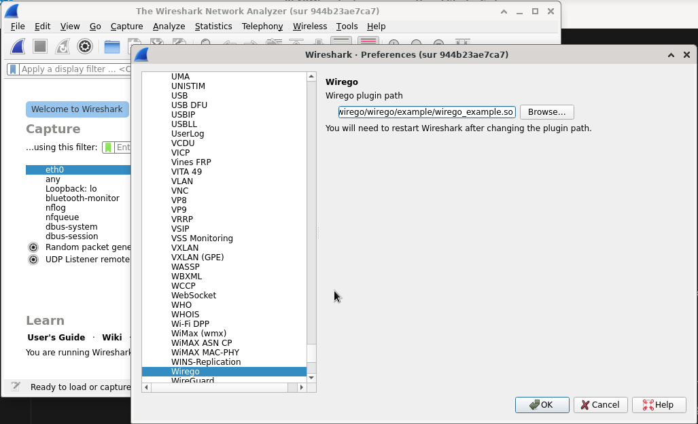

# Setting up Wireshark and running

## Installing the Wirego plugin for Wireshark

Once you have built the Wirego plugin for Wireshark (or downloaded a pre-built version), you should have a plugin named __wirego.so__.

Refer to the [Wireshark documentation](https://www.wireshark.org/docs/wsug_html_chunked/ChPluginFolders.html), depending on your platform, to know where the plugin should be dropped.
You may also want to take a look at [https://www.wireshark.org/docs/wsug_html_chunked/ChConfigurationPluginFolders.html](https://www.wireshark.org/docs/wsug_html_chunked/ChConfigurationPluginFolders.html) which may give different hints.

To make sure your plugin has been properly loaded, open Analyze>Enabled Protocols and search for "wirego".

If your golang plugin fails to load for any reason, the plugin will not appear on that list.

## Loading your plugin

Once the Wirego plugin for Wireshark is installed open Wireshark preferences, select "Protocols" on the left menu and then locate "Wirego".

Click the "Browse" button to locate your plugin written in Go.

You will need to restart Wireshark for the changes to be applied.