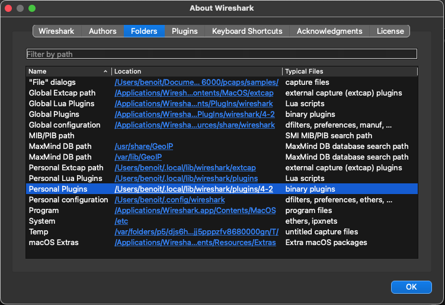

# Setting up Wireshark and running

## Running your remote

During Wireshark startup, the Wirego bridge plugin will try to establish a connection to your program.
Before anything else, it's probably time to start your remote developed using a Wirego package (see wirego_remote/go/ or wirego_remote/python/).
If you're remote is not ready yet, the best way to get started is to copy/paste the "minimal" example from your preferred **wirego_remote** language folder.

Your remote program will wait for connections from the Wirego bridge.

## Installing the Wirego plugin for Wireshark

Once you have built the Wirego plugin for Wireshark (or downloaded a pre-built version), you should have a Wireshark plugin named __wirego.so__.

Refer to the [Wireshark documentation](https://www.wireshark.org/docs/wsug_html_chunked/ChPluginFolders.html) to know where the plugin should be dropped.
You may also want to take a look at [https://www.wireshark.org/docs/wsug_html_chunked/ChConfigurationPluginFolders.html](https://www.wireshark.org/docs/wsug_html_chunked/ChConfigurationPluginFolders.html) which may give different hints.

Another option is to start Wireshark, open the "About" dialog, click on the "Folders" tab and search for the "Personal Plugins" entry:

To make sure your plugin has been properly loaded, open Preferences>Protocols and search for "wirego".

## Configuring your endpoint

Once the Wirego plugin for Wireshark is installed open Wireshark preferences, select "Protocols" on the left menu and then locate "Wirego".

Enter the endpoint to match the one used on you **Wirego remote plugin** then **restart Wireshark**

The endpoint can use one of the following format:

  - **ipc:///tmp/wirego0** (you can replace _/tmp/wirego0_ with whatever path your want), this uses local sockets and is the preferred method.
  - **tcp://127.0.0.1:1234** (you can set the IP:Port to whatever your want), this will use a TCP connection
  - **udp://127.0.0.1:1234** (you can set the IP:Port to whatever your want), this will use a UDP connection
  

During the next startup, Wirego remote will establish a ZMQ connection to your Wirego remote.

It's probably time to open a pcap file and see your remote plugin in action!