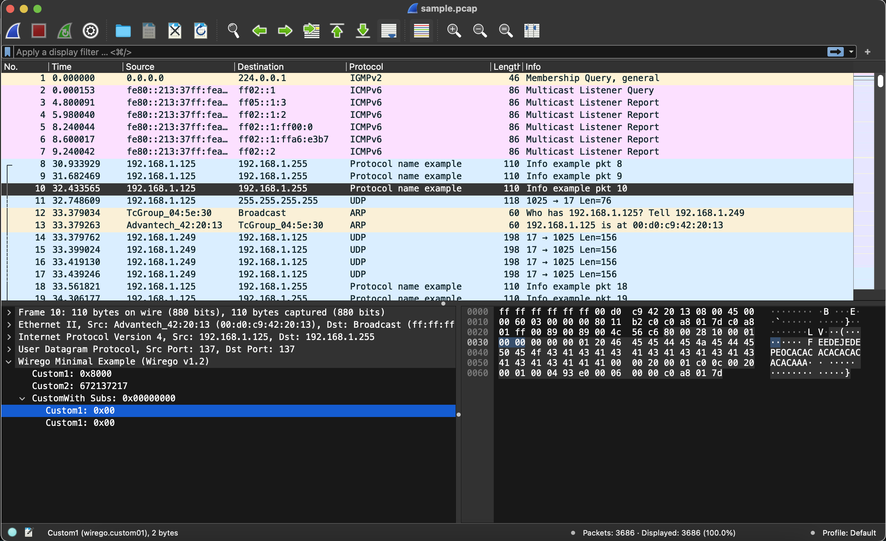

# Reolink Credentials Light example plugin

The complete code of this example can be found [here](./wirego_reolinkcredslight.go)
Before getting deep in this example, you should probably take a look at the [minimalist](../examples/minimal/README.md) example.

## Introduction

This simple plugin parses authentication requests made to a Reolink network camera.
Traffic is sent in clear form, over HTTP on port 80.
An example pcap can be found [here](./reolink_sample.pcapng).

This plugin extracts credentials passed to the camera and uses the response to detect wether those were valid or not.
Credentials and response are transmitted using simple JSON structures over HTTP.




## Implementation

During **init**, which is called at package initialization (hence when the plugin is loaded), we register to the Wirego package. As previously explained, the cache is disabled: in order to flag the requests as "valid" or "invalid" we need to be able to update the http request result.

```golang
type WiregoReolinkCreds struct {
}

// Unused (but mandatory)
func main() {}

// Called at golang environment initialization (you should probably not touch this)
func init() {
	var wge WiregoReolinkCreds

	//Register to the wirego package
	wirego.Register(wge)

  //Enable the Wirego cache, so that Wireshark will not ask us to parse the same packet multiple times
	wirego.ResultsCacheEnable(false)
}
```

The **Setup** is not used here, we don't have anything to initialize.

```golang
// This function is called when the plugin is loaded.
func (WiregoReolinkCreds) Setup() error {
	return nil
}
```

**GetName** returns the name of our plugin.

**GetFilter** defines the string that we will use to filter the packets matching our protocol in Wireshark.

```golang
// This function shall return the plugin name
func (WiregoReolinkCreds) GetName() string {
	return "Wirego Reolink Credentials"
}

// This function shall return the wireshark filter
func (WiregoReolinkCreds) GetFilter() string {
	return "reolink"
}
```


The **GetFields** function is used to declare tree distinct custom fields pointing to the user, password and authentication result code. We define first associated "enums" and then for each field how we want it to be displayed and called inside Wireshark.

```golang

// Define here enum identifiers, used to refer to a specific field
const (
	FieldIdUser       wirego.FieldId = 1
	FieldIdPassword   wirego.FieldId = 2
	FieldIdAuthResult wirego.FieldId = 3
)

// GetFields returns the list of fields descriptor that we may eventually return
// when dissecting a packet payload
func (WiregoReolinkCreds) GetFields() []wirego.WiresharkField {
	var fields []wirego.WiresharkField

	//Setup our wireshark custom fields
	fields = append(fields, wirego.WiresharkField{WiregoFieldId: FieldIdUser, Name: "User", Filter: "reolink.user", ValueType: wirego.ValueTypeString, DisplayMode: wirego.DisplayModeNone})
	fields = append(fields, wirego.WiresharkField{WiregoFieldId: FieldIdPassword, Name: "Password", Filter: "reolink.password", ValueType: wirego.ValueTypeString, DisplayMode: wirego.DisplayModeNone})
	fields = append(fields, wirego.WiresharkField{WiregoFieldId: FieldIdAuthResult, Name: "Authentication result", Filter: "reolink.authresult", ValueType: wirego.ValueTypeString, DisplayMode: wirego.DisplayModeNone})

	return fields
}
```

As previously explained, detection will be performed using a filter on TCP port 80. This filter is defined in **GetDetectionFilters**.

```golang
// GetDetectionFilters returns a wireshark filter that will select which packets
// will be sent to your dissector for parsing.
// Two types of filters can be defined: Integers or Strings
func (WiregoReolinkCreds) GetDetectionFilters() []wirego.DetectionFilter {
	var filters []wirego.DetectionFilter
	filters = append(filters, wirego.DetectionFilter{FilterType: wirego.DetectionFilterTypeInt, Name: "tcp.port", ValueInt: 80})

	return filters
}
```


Since we can't use heuristics, **GetDetectionHeuristicsParents** and **DetectionHeuristic** are left empty.

```golang
// GetDissectorFilterHeuristics returns a list of protocols on top of which detection heuristic
// should be called.
func (WiregoReolinkCreds) GetDetectionHeuristicsParents() []string {
	return []string{}
}

func (WiregoReolinkCreds) DetectionHeuristic(packetNumber int, src string, dst string, layer string, packet []byte) bool {
	return false
}
```

The protocol dissection occurs in **DissectPacket**:

  - we first try to parse the TCP payload as an HTTP request
  - if this fails, we try to parse it as an http response

```golang
// DissectPacket provides the packet payload to be parsed.
func (w WiregoReolinkCreds) DissectPacket(packetNumber int, src string, dst string, layer string, packet []byte) *wirego.DissectResult {
	var res wirego.DissectResult

	//Create a bufio.Reader from the packet slice
	r := bytes.NewReader(packet)
	buf := bufio.NewReader(r)

	//Try to parse as an http request
	req, err := http.ReadRequest(buf)
	if err == nil {
		//Success? Call the dissect request function
		return w.DissectRequest(packetNumber, src, dst, layer, req, packet)
	}

	//This failed, rewing the buffer and retry as a Response
	r.Seek(0, io.SeekStart)
	buf.Reset(r)

	//Look for associated http request
	closestRequestIdx := -1
	for i := 0; i < len(requestsCache); i++ {
		if requestsCache[i].packetNumber >= packetNumber {
			break
		}
		closestRequestIdx = i
	}
	//No previous request found, abort
	if closestRequestIdx == -1 {
		return &res
	}

	//Parse as an http response
	resp, err := http.ReadResponse(buf, requestsCache[closestRequestIdx].req)
	if err == nil {
		//Success? Call the dissect response function
		return w.DissectResponse(packetNumber, src, dst, layer, resp, closestRequestIdx, packet)
	}
	return &res
}
```

I won't copy paste the code for the two last functions since this is generic code not really related to Wirego.


The **request dissector** parses the TCP payload using the golang "http" package and then applies what could have been our detection heuristic: check if the URI is *"/cgi-bin/api.cgi?cmd=Login"*.
If this late detection succeeds, the HTTP payload is parsed using the golang "json" package and credentials are extracted.

In order to parse an http response, the golang "http" package requires the associated request. We update a cache containing all requests and their packet number.

The **response dissector** will look into the requests cache for a matching request (the closest lower packet number). The http payload is parsed using the golang "json" package and the authentication result is retrieved. The requests cache is updated with the authentication result.


## Multiple pass management

Wireshark uses a multiple pass strategy.
When a pcap is loaded, all packets are passed to the dissectors following the capture order.

Atfter this first pass, dissectors are called again depending on the Wireshark's window focus.
At this point, there's no guarantee that the passed packets follows any order, this totally depends on what is displayed.

In our plugin, after the first pass the requests dissector will not be able to tell if the request was successfull or not. During later passes, the cache has been updated by the results dissector.

