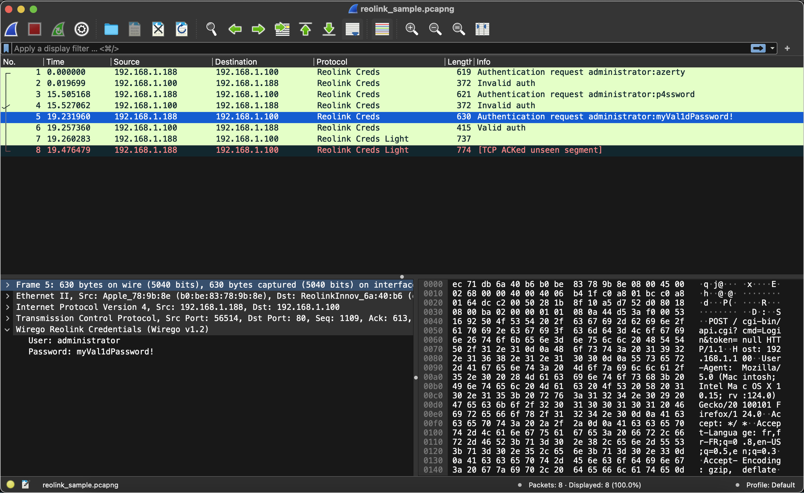

# Reolink Credentials example plugin

The complete code of this example can be found [here](./wirego_reolinkcreds_light.go)
Before getting deep in this example, you should probably take a look at the [minimalist](../minimal/README.md) example.

## Introduction

This simple plugin parses authentication requests made to a Reolink network camera.
Traffic is sent in clear form, over HTTP on port 80.
An example pcap can be found [here](./reolink_sample.pcapng).

This plugin extracts credentials passed to the camera and uses the response to detect wether those were valid or not.
Credentials and response are transmitted using simple JSON structures over HTTP.



## Implementation

During **init**, which is called at package initialization (hence when the plugin is loaded), we register to the Wirego package. As previously explained, the cache is disabled: in order to flag the requests as "valid" or "invalid" we need to be able to update the http request result.

```golang
type WiregoReolinkCreds struct {
}

// Unused (but mandatory)
func main() {}

// Called at golang environment initialization (you should probably not touch this)
func init() {
	var wge WiregoReolinkCreds

	//Register to the wirego package
	wirego.Register(wge)

  //Enable the Wirego cache, so that Wireshark will not ask us to parse the same packet multiple times
	wirego.ResultsCacheEnable(true)
}
```

In the **Setup** we just initialize a pointer to the last seen request to nil.

```golang
// This function is called when the plugin is loaded.
func (WiregoReolinkCreds) Setup() error {
  lastSeenRequest = nil
	return nil
}
```

**GetName** returns the name of our plugin.

**GetFilter** defines the string that we will use to filter the packets matching our protocol in Wireshark.

```golang
// This function shall return the plugin name
func (WiregoReolinkCreds) GetName() string {
	return "Wirego Reolink Credentials"
}

// This function shall return the wireshark filter
func (WiregoReolinkCreds) GetFilter() string {
	return "reolink"
}
```


The **GetFields** function is used to declare tree distinct custom fields pointing to the user, password and authentication result code. We define first associated "enums" and then for each field how we want it to be displayed and called inside Wireshark.

```golang

// Define here enum identifiers, used to refer to a specific field
const (
	FieldIdUser       wirego.FieldId = 1
	FieldIdPassword   wirego.FieldId = 2
	FieldIdAuthResult wirego.FieldId = 3
)

// GetFields returns the list of fields descriptor that we may eventually return
// when dissecting a packet payload
func (WiregoReolinkCreds) GetFields() []wirego.WiresharkField {
	var fields []wirego.WiresharkField

	//Setup our wireshark custom fields
	fields = append(fields, wirego.WiresharkField{WiregoFieldId: FieldIdUser, Name: "User", Filter: "reolink.user", ValueType: wirego.ValueTypeString, DisplayMode: wirego.DisplayModeNone})
	fields = append(fields, wirego.WiresharkField{WiregoFieldId: FieldIdPassword, Name: "Password", Filter: "reolink.password", ValueType: wirego.ValueTypeString, DisplayMode: wirego.DisplayModeNone})
	fields = append(fields, wirego.WiresharkField{WiregoFieldId: FieldIdAuthResult, Name: "Authentication result", Filter: "reolink.authresult", ValueType: wirego.ValueTypeString, DisplayMode: wirego.DisplayModeNone})

	return fields
}
```

In order to detect our "protocol"", we will match all traffic on TCP port 80. More details about this (and why) in the (next example)[../reolinkcreds/README.md].

```golang
// GetDetectionFilters returns a wireshark filter that will select which packets
// will be sent to your dissector for parsing.
// Two types of filters can be defined: Integers or Strings
func (WiregoReolinkCreds) GetDetectionFilters() []wirego.DetectionFilter {
	var filters []wirego.DetectionFilter
	filters = append(filters, wirego.DetectionFilter{FilterType: wirego.DetectionFilterTypeInt, Name: "tcp.port", ValueInt: 80})

	return filters
}
```


Since we can't use heuristics, **GetDetectionHeuristicsParents** and **DetectionHeuristic** are left empty.

```golang
// GetDissectorFilterHeuristics returns a list of protocols on top of which detection heuristic
// should be called.
func (WiregoReolinkCreds) GetDetectionHeuristicsParents() []string {
	return []string{}
}

func (WiregoReolinkCreds) DetectionHeuristic(packetNumber int, src string, dst string, layer string, packet []byte) bool {
	return false
}
```

The protocol dissection occurs in **DissectPacket**:

  - we first try to parse the TCP payload as an HTTP request
  - if this fails, we try to parse it as an http response

```golang
// DissectPacket provides the packet payload to be parsed.
func (w WiregoReolinkCreds) DissectPacket(packetNumber int, src string, dst string, layer string, packet []byte) *wirego.DissectResult {
	var res wirego.DissectResult

	r := bytes.NewReader(packet)
	buf := bufio.NewReader(r)

	//Try to parse as a request
	req, err := http.ReadRequest(buf)
	if err == nil {
		return w.DissectRequest(packetNumber, src, dst, layer, req, packet)
	}

	r.Seek(0, io.SeekStart)
	buf.Reset(r)

	//Maybe a response

	//No previous request seen
	if lastSeenRequest == nil {
		return &res
	}

	resp, err := http.ReadResponse(buf, lastSeenRequest)
	if err == nil {
		return w.DissectResponse(packetNumber, src, dst, layer, resp, packet)
	}
	return &res
}
```

The **request dissector** parses the TCP payload using the golang "http" package and then applies what could have been our detection heuristic: check if the URI is *"/cgi-bin/api.cgi?cmd=Login"*.
If this late detection succeeds, the HTTP payload is parsed using the golang "json" package and credentials are extracted.

```golang
func (WiregoReolinkCreds) DissectRequest(packetNumber int, src string, dst string, layer string, req *http.Request, packet []byte) *wirego.DissectResult {
	var res wirego.DissectResult
	var authRequest []ReolinkAuthRequest

	res.Protocol = "Reolink Creds Light"

	//Late detection heuristic
	if !strings.HasPrefix(req.RequestURI, "/cgi-bin/api.cgi?cmd=Login") {
		return &res
	}

	//Parse http body as a json payload
	body, err := io.ReadAll(req.Body)
	if err != nil {
		return &res
	}
	err = json.Unmarshal(body, &authRequest)
	if err != nil {
		return &res
	}

	//Make sure we've parsed something that looks like a Reolink authentication request
	if len(authRequest) == 0 {
		return &res
	}
	if (authRequest[0].Cmd != "Login") || (len(authRequest[0].Param.User.UserName) == 0) || (len(authRequest[0].Param.User.Password) == 0) {
		return &res
	}

	//Set Protocol and info fields
	res.Protocol = "Reolink Creds"
	res.Info = fmt.Sprintf("Authentication request %s:%s", authRequest[0].Param.User.UserName, authRequest[0].Param.User.Password)

	//Offsets sent to Wireshark must refer to the "packet" data sent to the dissector
	//Since we've registered on top of TCP port 80, it's quite hard to predict where the user and passwords fields
	//are located. We use a simple strategy here (this will obviously fail if the password is, for example "cgi-bin")
	userOffset := bytes.Index(packet, []byte(authRequest[0].Param.User.UserName))
	if userOffset != -1 {
		res.Fields = append(res.Fields, wirego.DissectField{WiregoFieldId: FieldIdUser, Offset: userOffset, Length: len(authRequest[0].Param.User.UserName)})
	}

	passwordOffset := bytes.Index(packet, []byte(authRequest[0].Param.User.Password))
	if passwordOffset != -1 {
		res.Fields = append(res.Fields, wirego.DissectField{WiregoFieldId: FieldIdPassword, Offset: passwordOffset, Length: len(authRequest[0].Param.User.Password)})
	}

  //Set a pointer to the last seen request
	lastSeenRequest = req

	return &res
}
```

In order to parse an http response, the golang "http" package requires the associated request. We keep a pointer updated with the last seen request.

The **response dissector** parses the http payload using the golang "json" package and the authentication result is retrieved.


```golang
func (WiregoReolinkCreds) DissectResponse(packetNumber int, src string, dst string, layer string, resp *http.Response, packet []byte) *wirego.DissectResult {
	var res wirego.DissectResult
	var authResponse []ReolinkAuthResponse

	body, err := io.ReadAll(resp.Body)
	if err != nil {
		return &res
	}

	err = json.Unmarshal(body, &authResponse)
	if err != nil {
		return &res
	}

	if len(authResponse) == 0 {
		return &res
	}

	if authResponse[0].Cmd != "Login" {
		return &res
	}

	//Update Protocol and Info fields
	res.Protocol = "Reolink Creds"
	if authResponse[0].Code == 1 {
		res.Info = "Invalid auth"
	} else if authResponse[0].Code == 0 {
		res.Info = "Valid auth"
	} else {
		res.Info = "Unknown result"
	}

	//Point to the authentication result
	detectString := "\"code\" : "
	resultOffset := bytes.Index(packet, []byte(detectString))
	if resultOffset != -1 {
		resultOffset += len(detectString)
		res.Fields = append(res.Fields, wirego.DissectField{WiregoFieldId: FieldIdAuthResult, Offset: resultOffset, Length: 1})
	}

	return &res
}
```