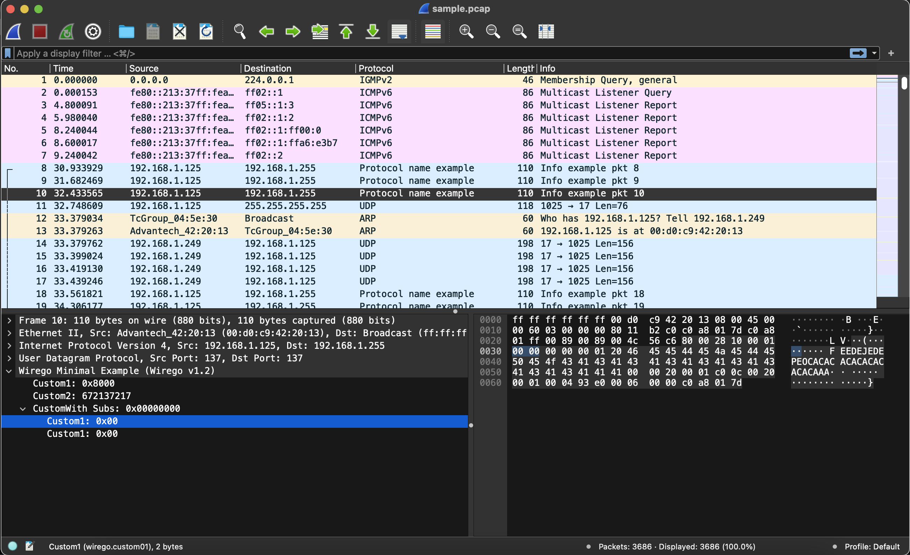

# Wirego plugin development guide - Minimalistic

Writing a Wirego plugin is quite simple.

The complete code of this example can be found [here](./wirego_minimal.go)




Before going any further, you should build this example and try to load it with the wirego Wireshark plugin.

    cd examples/minimal/
    make


Our plugin in Go will need to instanciate the "wirego" package using "New":

```golang
package main

import (
  "encoding/hex"
  "fmt"
  "wirego/wirego"
)

// Since we implement the wirego.WiregoInterface we need some structure to hold it.
type WiregoExample struct {
}

func main() {
	var wge WiregoMinimalExample

	wg, err := wirego.New("ipc:///tmp/wirego0", false, wge)
	if err != nil {
		fmt.Println(err)
		return
	}
	wg.ResultsCacheEnable(false)

	wg.Listen()
}
```

We create a new Wirego instance by passing the ZMQ endpoint to be used, a verbodity flag and a pointer to the object implementing the interface.
The ZMQ endpoint is a standard ZMQ string, such as:

  - tcp://127.0.0.1:1234  listen locally on TCP port 1234
	- udp://192.168.1.1:4561 listen on an external interface, on UDP port 4561
	- ipc:///tmp/wirego0 listen on a local IPC (ie unix socket)


Now we just need to implement the WiregoInterface interface.


**GetName** returns the name of our example plugin and **GetFilter** defines the string that we will use to filter the packets matching our protocol in Wireshark.


```golang
// This function shall return the plugin name
func (WiregoExample) GetName() string {
  return "Wirego Example"
}

// This function shall return the wireshark filter
func (WiregoExample) GetFilter() string {
  return "wgexample"
}
```

During initialization, a plugin has to declare all the **fields** that may eventually be returned (so that Wireshark can setup the GUI).
In this example we declare three fields:

  - a first one, named "Custom1" which is an uint8, displayed in hexadeciaml
  - a second one, named "Custom2" which is an uint16, displayed in decimal
  - and a third one, named "CustomWith Subs" which is an uint32, displayed in decimal

During parsing ("dissection" in Wireshark's terminology), when a field has been found, we will refer to it using the defined "WiregoFieldId".

```golang
// Define here enum identifiers, used to refer to a specific field
const (
	FieldIdCustom1             wirego.FieldId = 1
	FieldIdCustom2             wirego.FieldId = 2
	FieldIdCustomWithSubFields wirego.FieldId = 3
)


// GetFields returns the list of fields descriptor that we may eventually return
// when dissecting a packet payload
func (WiregoExample) GetFields() []wirego.WiresharkField {
  var fields []wirego.WiresharkField
  fields = append(fields, wirego.WiresharkField{WiregoFieldId: FieldIdCustom1, Name: "Custom1", Filter: "wirego.custom01", ValueType: wirego.ValueTypeUInt8, DisplayMode: wirego.DisplayModeHexadecimal})
  fields = append(fields, wirego.WiresharkField{WiregoFieldId: FieldIdCustom2, Name: "Custom2", Filter: "wirego.custom02", ValueType: wirego.ValueTypeUInt16, DisplayMode: wirego.DisplayModeDecimal})

	fields = append(fields, wirego.WiresharkField{WiregoFieldId: FieldIdCustomWithSubFields, Name: "CustomWith Subs", Filter: "wirego.custom_subs", ValueType: wirego.ValueTypeUInt32, DisplayMode: wirego.DisplayModeHexadecimal, })

  return fields
}
```


In order to tell Wireshark which packets should be sent to your dissector, two methods are available:

  - use Wireshark **filters** to match on a given traffic (ex. udp.port == 137)
  - register a **heuristic** detection function which will be called on a given protocol (ex. "apply my heuristic function on all TCP payloads")

The first method is faster but not always relevant. If your protocol works on a given HTTP traffic, you probably don't want to redirect all TCP port 80 to your dissector.
The second option lets you register on HTTP traffic and apply an heuristic function to detect if this packet should be redirected to your dissector or not.
You can use both method at the same time, but need to used at least one.

Let's start with the **filter** method:

```golang
// GetDetectionFilters returns a wireshark filter that will select which packets
// will be sent to your dissector for parsing.
// Two types of filters can be defined: Integers or Strings
func (WiregoExample) GetDetectionFilters() []wirego.DetectionFilter {
  var filters []wirego.DetectionFilter

  filters = append(filters, wirego.DetectionFilter{FilterType: wirego.DetectionFilterTypeInt, Name: "udp.port", ValueInt: 137})
  filters = append(filters, wirego.DetectionFilter{FilterType: wirego.DetectionFilterTypeString, Name: "bluetooth.uuid", ValueString: "1234"})

  return filters
}
```


When using detection **heuristics** mode, if a packet matches the "heuristics parent" previously defined, a detection function will be called. Return true if the packet is ours and false otherwise.

```golang
// GetDetectionHeuristicsParents returns a list of protocols on top of which detection heuristic
// should be called.
func (WiregoExample) GetDetectionHeuristicsParents() []string {
	//We want to apply our detection heuristic on all tcp and http payloads
	return []string{"udp", "http"}
}

func (WiregoExample) DetectionHeuristic(packetNumber int, src string, dst string, layer string, packet []byte) bool {
	//All packets starting with 0x00 should be passed to our dissector (super advanced heuristic)
	if len(packet) != 0 && packet[0] == 0x00 {
		return true
	}
	return false
}
```


The most interesting part is the DissectPacket function, where we will implement our parser:

```golang
// DissectPacket provides the packet payload to be parsed.
func (WiregoMinimalExample) DissectPacket(packetNumber int, src string, dst string, layer string, packet []byte) *wirego.DissectResult {
	var res wirego.DissectResult

	//This string will appear on the packet being parsed
	res.Protocol = "Protocol name example"

	//This (optional) string will appear in the info section
	res.Info = fmt.Sprintf("Info example pkt %d", packetNumber)

	//Add a few fields and refer to them using our own "internalId"
	res.Fields = append(res.Fields, wirego.DissectField{WiregoFieldId: FieldIdCustom1, Offset: 0, Length: 2})
	res.Fields = append(res.Fields, wirego.DissectField{WiregoFieldId: FieldIdCustom2, Offset: 2, Length: 4})

	//Add a field with two sub field
	subField1 := wirego.DissectField{WiregoFieldId: FieldIdCustom1, Offset: 6, Length: 2}
	subField2 := wirego.DissectField{WiregoFieldId: FieldIdCustom1, Offset: 8, Length: 2}
	field := wirego.DissectField{WiregoFieldId: FieldIdCustomWithSubFields, Offset: 6, Length: 4, SubFields: []wirego.DissectField{subField1, subField2}}
	res.Fields = append(res.Fields, field)

	//Dump packet contents
	//fmt.Println(layer, " ", src, " to ", dst)
	//fmt.Println(hex.Dump(packet))
	return &res
}
```

The last step is to build our plugin using:

      go build


And that's all.

Now:

  1. run your remote plugin: ./wirego_minimal
	2. run Wireshark, to go Preferences -> Wirego and type the ZMQ endpoint string defined on the main() function. Restart Wireshark.


