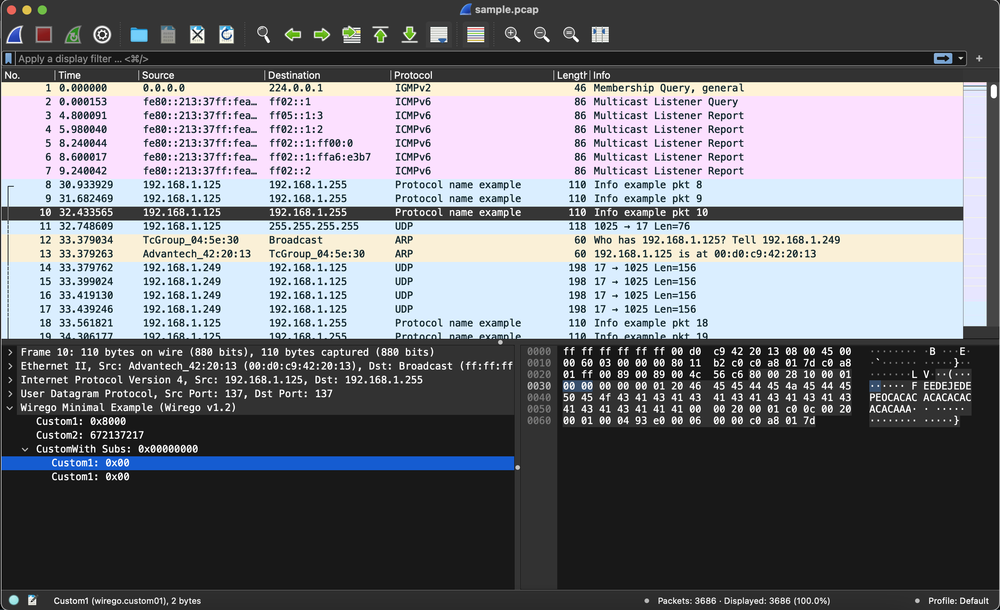

# Wirego plugin development guide - Minimalistic

Writing a Wirego plugin is quite simple.

The complete code of this example can be found [here](./wirego_minimal.py)



Our plugin in Python first imports the **wirego** package and then declares a class inheriting the **wirego.WiregoListener** class:

```python
	import wirego
#[...]
	class WiregoMinimal(wirego.WiregoListener):
			# This function shall return the plugin name
			def get_name(self):
#[...]
```

Since we inherit the **wirego.WiregoListener** we have a few methods to implement. These will be used to receive requests coming from Wireshark.


The two first methods are quite obvious:

  - **get_name** returns the name of our example plugin 
  - **get_filter** defines the string that we will use to filter the packets matching our protocol in Wireshark.


```python
    # This function shall return the plugin name
    def get_name(self):
        return "Wirego Minimal Example"

    # This function shall return the wireshark filter
    def get_filter(self):
        return "wgminexample"
```

During initialization, a plugin has to declare all the **fields** that may eventually be returned (so that Wireshark can setup the GUI).
In this example we declare three fields:

  - a first one, named "Custom1" which is an uint8, displayed in hexadeciaml
  - a second one, named "Custom2" which is an uint16, displayed in decimal
  - and a third one, named "Custom With Subs" which is an uint32, displayed in decimal

During parsing ("dissection" in Wireshark's terminology), when a field has been found, we will simply refer to it using the defined "FieldEnum".

```python
	# Define here enum identifiers, used to refer to a specific field
	class FieldEnum(IntEnum):
		FieldIdCustom1  = 0x01
		FieldIdCustom2  = 0x02
		FieldIdCustomWithSubFields  = 0x03
		
    # GetFields returns the list of fields descriptor that we may eventually return
    # when dissecting a packet payload
	def get_fields(self):
		return [
			wirego.WiregoField(FieldEnum.FieldIdCustom1, "Custom1", "wirego.custom01", wirego.ValueType.ValueTypeUInt8, wirego.DisplayMode.DisplayModeHexadecimal),
			wirego.WiregoField(FieldEnum.FieldIdCustom1, "Custom2", "wirego.custom02", wirego.ValueType.ValueTypeUInt16, wirego.DisplayMode.DisplayModeDecimal),
			wirego.WiregoField(FieldEnum.FieldIdCustomWithSubFields, "Custom With Subs", "wirego.custom_subs", wirego.ValueType.ValueTypeUInt32, wirego.DisplayMode.DisplayModeHexadecimal),
		]
```


In order to tell Wireshark which packets should be sent to your dissector, two methods are available:

  - use Wireshark **filters** to match on a given traffic (ex. udp.port == 137)
  - register a **heuristic** detection function which will be called on a given protocol (ex. "apply my heuristic function on all TCP payloads")

The first method is faster but not always relevant. If your protocol works on a given HTTP traffic, you probably don't want to redirect all TCP port 80 to your dissector.
The second option lets you register on HTTP traffic and apply an heuristic function to detect if this packet should be redirected to your dissector or not.
You can use both method at the same time, but need to used at least one.

Let's start with the **filter** method, in our example we want to dissect packets on UDP port 137 or with Bluetooth UUID equals to 1234.

```python
	# get_detection_filters returns a wireshark filter that will select which packets
	# will be sent to your dissector for parsing.
	# Two types of filters can be defined: Integers or Strings
	def get_detection_filters(self):
		return [
			wirego.DetectionFilter(wirego.DetectionFilterType.DetectionFilterTypeInt, "udp.port", 137, ""),
			wirego.DetectionFilter(wirego.DetectionFilterType.DetectionFilterTypeStr, "bluetooth.uuid", 0, "1234"),
		]
```


When using detection **heuristics** mode, if a packet matches the "heuristics parent" previously defined, a detection function will be called. Return true if the packet is ours and false otherwise.
In our example, we want to process packets under an UDP or HTTP layer. Packets starting with a nul byte sould be sent to the dissector.

```python
	# get_detection_heuristics_parents returns a list of protocols on top of which detection heuristic
	# should be called.
	def get_detection_heuristics_parents(self):
		return [
			"udp", 
			"http",
		]

	# detection_heuristic applies an heuristic to identify the protocol.
	def detection_heuristic(self, packet_number: int, src: str, dst: str, stack: str, packet: bytes) -> bool:
		#All packets starting with 0x00 should be passed to our dissector (super advanced heuristic)
		if (len(packet) != 0) and (packet[0] == 0x00):
			return True
		return False
```


The most interesting part is the **dissect_packet** function, where we will implement our parser:

```python
	#dissect_packet provides the packet payload to be parsed.
	def dissect_packet(self, packet_number: int, src: str, dst: str, stack: str, packet: bytes) -> wirego.DissectResult:
		#This string will appear on the packet being parsed
		protocol = "Protocol name example"

		#This (optional) string will appear in the info section
		info = "Info example pkt " + str(packet_number)

		fields = []

		#Add a few fields and refer to them using our own "internalId"
		if len(packet) > 6:
			# Found a field of type FieldIdCustom1 at offset 0 with a size of 2
			fields.append(wirego.DissectField(FieldEnum.FieldIdCustom1, 0, 2, []))
			# Found a field of type FieldIdCustom2 at offset 2 with a size of 4
			fields.append(wirego.DissectField(FieldEnum.FieldIdCustom2, 2, 4, []))
	
		#Add a field with two sub field
		if len(packet) > 10:
			subField1 = wirego.DissectField(FieldEnum.FieldIdCustom1, 6, 2, [])
			subField2 = wirego.DissectField(FieldEnum.FieldIdCustom2, 8, 2, [])
			field = wirego.DissectField(FieldEnum.FieldIdCustomWithSubFields, 6, 4, [subField1, subField2])
			fields.append(field)
		
		return wirego.DissectResult(protocol, info, fields)

```
Our plugin is now ready, we just have to register it to the wirego remote and listen for incoming ZMQ requests.

```python
print("Wirego remote Python example")

# Create our listener
tl = WiregoMinimal()

# Instanciate wirego with ZMQ endpoint "ipc:///tmp/wirego0"
wg = wirego.Wirego("ipc:///tmp/wirego0", False, tl)
wg.results_cache_enable(True)

wg.listen()
```

In order to run our plugin, simply:

  - Run "python3 wirego_minimal.py"
	- Start (or restart) Wireshark and open the example pcap in this folder

If this doesn't work:

  - Change the Wirego instanciation to **wg = wirego.Wirego("ipc:///tmp/wirego0", True, tl)** to switch verbose mode
	- In Wireshark, go the wirego plugin settings and make sure the endpoint is the same as the one used in this example (**"ipc:///tmp/wirego0"**)